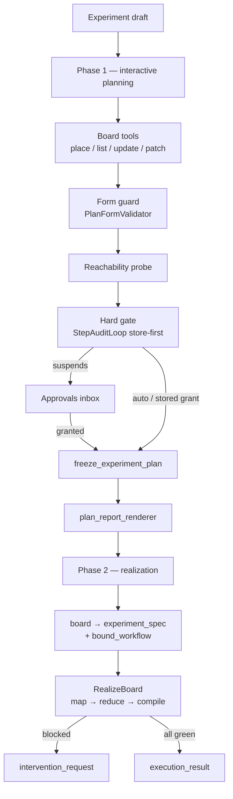

# Plan Mode Architecture

`PlanOrchestrator` turns a natural-language experiment draft into a **task
board**, a human-approved plan report, and — by default — a **realized**
workflow: bound tasks → per-task code generation with self-repair → a
compile-only dry run. It is the **only** planning pipeline `molexp.harness`
ships. (Note: the `molexp plan` CLI currently stops at the frozen plan +
report — Phase 2 is not yet driven by that command; `--execute` only prints
a notice.)

The CLI (`molexp plan`) and the server (`POST /plan-tasks`) both drive the
same path through `services.plan_runtime.drive_plan_mode`; they never call
each other.

The harness reaches the LLM only through the agent layer's `Router` Protocol
(`RouterBackedAgentGateway`); the workflow engine is **never** loaded inside
the harness process — pytest and the compile dry run execute in **executor
subprocesses**.

## Two phases (not a nine-step ledger)



| Phase | What happens | Representative artifacts |
|-------|--------------|--------------------------|
| **1 — planning** | InteractiveLoop + board tools; form guard; reachability; hard review | `experiment_plan`, `review_pack`, `frozen_experiment_plan`, `plan_report` |
| **2 — realization** | Materialize bound → RealizeBoard | `bound_workflow`, `workflow_source`, `test_source`, `execution_result` (or `intervention_request`) |

There is **no** linear nine-step `Mode` ledger. Resume after the hard gate is
**store-first**. Phase 2 is skipped only with `PlanOrchestrator(realize=False)`
(tests, or a deliberate plan-only run).

## Phase 1 — interactive planning

1. **Spec seed** — free text → `{title, objective}`; a JSON object is kept
   verbatim as the opaque `spec`.
2. **Board tools** — the production implementation is `DiskTaskBoard`
   (`run_dir/plan/task_board.json`). Tools: `place_task` / `list_tasks` /
   `inspect_*` / `update_task` / `complete_task` / `block_task` /
   `propose_plan_patch`. The adapter injects `ctx` and `board`.
3. **Form guard** — `require_feasibility=False` inside the loop; reachability
   is annotated after the loop finishes.
4. **Hard review** — includes forms such as the **keep_tasks** multi-select.
   No approver and no stored grant → `ApprovalPendingError`. **Both approve
   and revise carry field_values**.

## Phase 2 — deterministic realization

After freeze and report: materialize `experiment_spec` + `bound_workflow`,
then `RealizeBoard` (parallel per-task codegen → reduce → compile-only). Any
task exceeding its budget → persist an `intervention_request` and raise
**before** compile.

## Approvals and resume

Gates are written to `run_dir/harness.sqlite`. Shared decide path:
`services.plan_runtime.decide_plan_review`. Scopes: `approval_gate` (Phase 1)
and `intervention_request` (Phase 2).

## On-disk layout

```text
runs/run-<id>/
├── plan/task_board.json
├── artifacts/
└── harness.sqlite
```

## Entry points

```bash
molexp plan "Screen solvent conditions for electrolyte X"
```

UI and CLI share the same `drive_plan_mode(PlanOrchestrator(...), ...)`. The
session progress-bar stages align with `planStages.ts` /
`record._STAGE_LABELS`.

## Related

- Operator guide: [Plan mode](../guide/plan-mode.md)
- Agent layer: [Agent architecture](agent.md)
- Workflow engine: [Workflow layer](workflow-layer.md)
